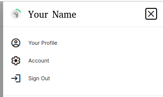
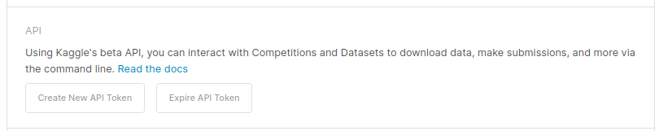

# Download Dataset Using Kaggle API in Colab

We can download the dataset from Kaggle using UI to our local machine, then upload it you Colab. **Why do we need Kaggle API?**

Imagine you need to use a large dataset from Kaggle, let's say 2 GB in size. It is impractical to download it to your local machine first, and upload it to Colab runtime. With Kaggle API, you can skip the first step, and... trust me, it will be much faster than you've imagined. XD

## All You Need
All you need:
1. Kaggle account.
1. Google account.

## Download Dataset Using Kaggle API in Colab
### Download the token for Kaggle API
Before using the Kaggle API, you need to create your token firs. Here are steps you need to do to download your token:
1. Login to your [Kaggle](www.kaggle.com) account.
1. Go to your account page by clicking your profile image on the top right page and click **Account**.</br>

1. On the account page, find API section. Click **"Create New API Toke"** button. This will download a file called **kaggle.json**.</br>


 [!] Don't share your kaggle.json file since it contains your credentials.

### Use Kaggle API to Download Kaggle's Dataset in Colab
After logging in to your Google account, go to [Colab page](www.colab.research.google.com).
1. Create a new notebook, and Connect to the runtime.
1. Upload your kaggle.json to your Colab runtime.
1. Download the dataset.
    For the example, I will use **Stanford Background Dataset by Balraj Ashwath** [https://www.kaggle.com/balraj98/stanford-background-dataset](https://www.kaggle.com/balraj98/stanford-background-dataset).
    To specify the dataset, you just need to use ```[username]/[dataset-name]```. In this case, the specifier will be ```balraj98/stanford-background-dataset```.
    Finally, to download the dataset, you can run this line on your notebook cell:
    ```
    ! KAGGLE_CONFIG_DIR=. kaggle datasets download balraj98/stanford-background-dataset
    ```

    [Note] You can change ```KAGGLE_CONFIG_DIR``` to the directory your kaggle.json located.

1. [OPTIONAL] Unzip the dataset, simpy by run this line:
    ```
    !unzip [filename.zip]
    ```